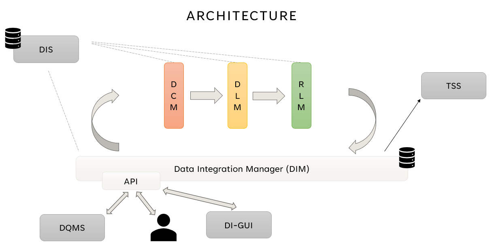

# Data Integrator

## Architecture

The pipeline is composed of the following filters:
- **Data Cleaner (DC)**: cleans web extracted data, giving then names to columns
- **Mediated Schema Manager (MSM)**: consists in getting one table obtained by concatenating all the tables got after data cleaning
- **Record Linkage Manager (RLM)**
- **Data Enrichment Manager (DEM)**

## Installation

### Python

With a terminal, go into _py_common_di_ and enter
`pip install .`, you are now ready to use it into other python projects.