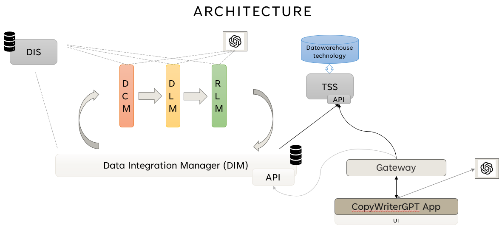

# Data Integrator

## Architecture



The pipeline is composed of the following filters:
- **Data Cleaner Manager (DCM)**: cleans extracted data
- **Data Labeler Manager (DLM)**: gives names to columns
- **Record Linkage Manager (RLM)**: record linkage (not in development)

Then, we have the following components
- **Data Integration Manager (DIM)**: manages all the operations for data integration and checks the pipeline status
- **Data Quality Management System (DQMS)**: called even data-quality-agent, it's used for api calls and performance tests comparing effective elaborated data with golden datasets
- **Table Storage System (TSS)**: a service for cleaned tables storage. It's used for data retrieval in scalable systems.

## Installation

### Java projects

Execute the following command in this folder

```gradle build```

### Docker execution

First, project has to be built with

```docker compose build```

Then, execution with

```docker compose up -d```

The system can be stopped with

```docker compose down```

## Useful resources

### Standard ontologies

Under the ```resources/``` folder of DataIntegrationManager the file ```ontologies.json``` 
contains a list of default ontologies that can be used for testing purposes.

### OpenAI Key

Set your OpenAI key for ChatGPT in docker-compose.yml file